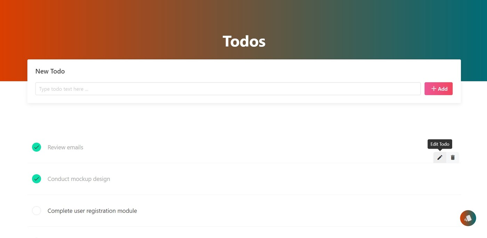
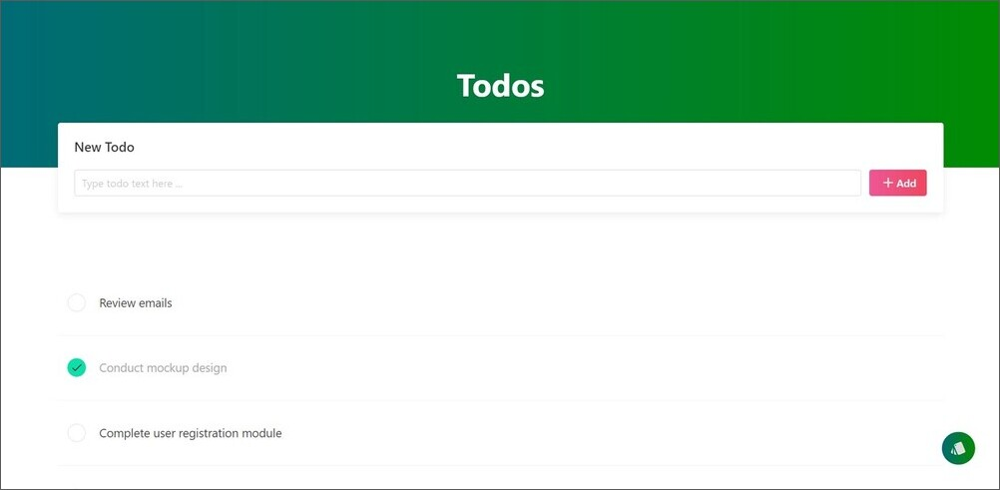
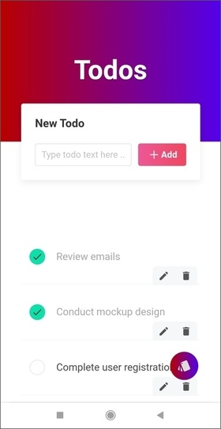
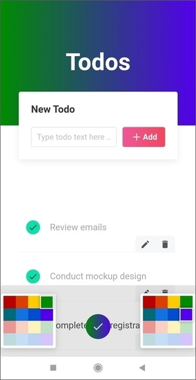

## Todo App

Este proyecto es una página web creada con Angular, que permite registrar, editar y eliminar tareas. Además, está diseñada de manera responsiva y está en inglés. Para los estilos se utilizó el Framework Bulma, Sass y Angular Material UI.

## Tecnologías principales

 Angular  
 LocalStorage  
 Bulma  
 Sass  
 Angular Material UI

## Capturas de pantalla

Aquí podrás encontrar una muestra de cómo se ve la aplicación en desktop y móvil.

# Créditos

El proyecto fue creado a partir de un video tutorial de YouTube del canal [Devstackr](https://www.youtube.com/watch?v=gvWxMQ_Zios).

## Links

[Live site URL](https://todo-app-yha.netlify.app/)

## Comparación de las tecnologías y características utilizadas

Video:

- Angular
- No se almacenan los datos

Todo App:

- Angular
- LocalStorage
- Se puede cambiar el estilo de los colores primarios

